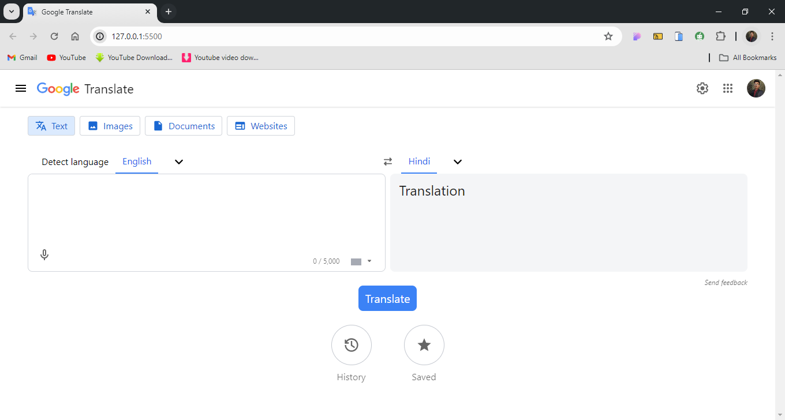
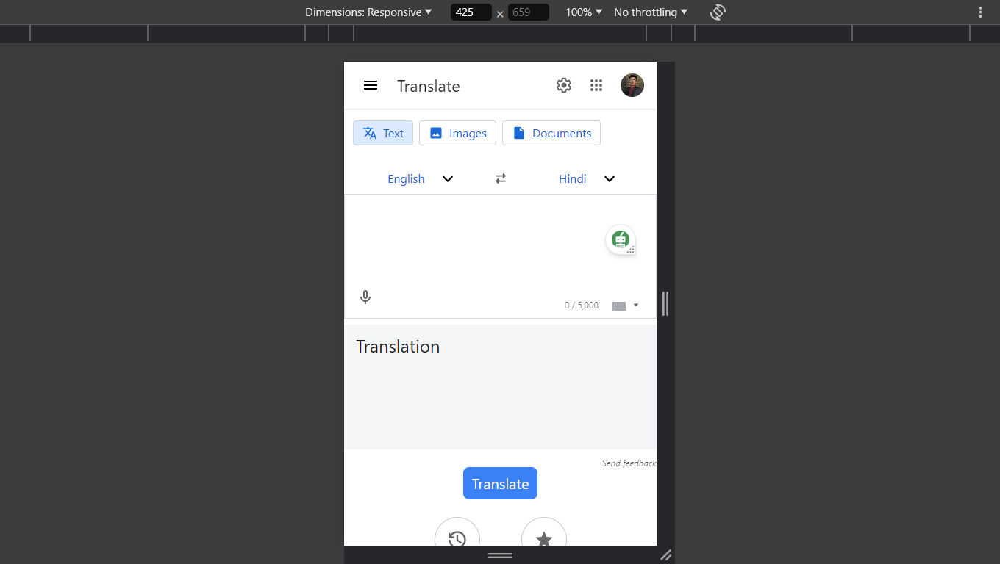

# Google Translate Clone

This project is a fully responsive Google Translate clone built with HTML, Tailwind CSS, and JavaScript. It mimics the core features of Google Translate, allowing users to translate text between multiple languages instantly.

## Live Demo

[Google Translate Clone](https://himanshu-paliwal-277.github.io/Google-Translate/)

## Features

- **Multi-language Support:** Support for numerous languages, enabling translations between a wide array of language pairs.

- **Responsive Design:** Fully responsive interface that adapts seamlessly to desktop, tablet, and mobile devices.

- **User-friendly Interface:** A clean and intuitive design that mirrors the look and feel of Google Translate.

- **Copy & Paste Functionality:** Users can easily copy and paste text into and from the translation input and output fields.

## Technologies Stack

 - ***HTML:*** Structure of the web application.
 - ***Tailwind:CSS:*** Styling of the web application.
 - ***JavaScript:*** Functionality and dynamic interactions in the web application.

## Project Screenshot

# In Desktop -

# In Mobile -

